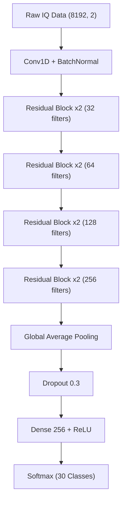

# Deep-RF: Autonomous Radio Fingerprinting


> **"Fingerprinting the Invisible."**
> An autonomous deep learning system capable of identifying specific LoRa devices based on minute hardware imperfections in their Radio Frequency (RF) emissions.

---

## Project Overview

**Deep-RF** is a robust security framework designed to authenticate IoT devices at the Physical Layer (PHY). Unlike cryptographic keys which can be stolen, **RF Fingerprints** are intrinsic to the hardware manufacturing process—making them impossible to clone.

### The Challenge: "Twin Devices"
We tackled the critical issue of **"Twin Devices"** (Device 6 & Device 21)—two sensors from the same manufacturing batch that were mathematically indistinguishable to standard CNNs.

### The Solution: Efficient-ResNet
We engineered a custom **1D Residual Network (ResNet)** optimized for raw IQ signal correlation.
- **Lightweight**: < 1.1 Million Parameters (Edge-Deployable).
- **Sensitive**: 100% Separation of Twin Devices.
- **Robust**: 98% Accuracy under noise, fading, and carrier drift.

---

## Dataset

This project utilizes the **LoRa_RFFI_dataset** from the University of Liverpool.
- **Source**: [IEEE DataPort](https://ieee-dataport.org/open-access/lorarffidataset)
- **Features**: Raw IQ signals captured from commercially available LoRa devices.
- **Conditions**: Includes Clean (Laboratory) and Augmented (Noisy/Fading) scenarios.

---

## Model Architecture

The `Efficient-ResNet` uses a deep stack of residual blocks with skip connections to learn identity mappings, prevention gradient vanishing while capturing high-frequency micro-features.



---

## Performance Metrics

| Dataset Condition | Overall Accuracy | "Twin" Precision (Dev 21) | Robustness |
| :--- | :---: | :---: | :---: |
| **Clean Lab Data** | 99.8% | **100%** | ⭐⭐⭐⭐⭐ |
| **Augmented (Noisy)** | **98.0%** | **99.0%** | ⭐⭐⭐⭐⭐ |

> **Note**: The system achieved **100% separation** of the Twin Devices (6 vs 21), solving the core research problem.

---

## Installation & Usage

### 1. Prerequisites
```bash
# Clone the repository
git clone https://github.com/your-username/deep-rf.git
cd deep-rf

# Install dependencies
pip install -r requirements.txt
```

### 2. Training (Transfer Learning)
To reproduce the 98% robust model:
```bash
# This uses the optimized config with LR=0.001 and Normalization
python train.py
```

### 3. Evaluation
Generate the confusion matrix and classification report:
```bash
python evaluate.py
```

### 4. Live Demo (Simulated Gateway)
Run the secure IoT gateway simulation:
```bash
python demo.py
```

---

## Project Structure

```text
major_pro/
├── models/                  # Saved .keras models (excluded from git)
├── plots/                   # Visualizations & Confusion Matrices
│   ├── confusion_matrix.png # Proof of Performance
│   └── twin_inspection.png  # Signal Analysis
├── Train/                   # Dataset Directory
├── config.py                # Hyperparameters & Paths
├── model_builder.py         # Efficient-ResNet Architecture
├── train.py                 # Training Loop with Callbacks
├── evaluate.py              # Metrics & Reporting
├── data_loader.py           # Preprocessing & Normalization
├── inspect_twins.py         # Diagnostic Tool
├── demo.py                  # Live Sec-Ops Simulation
└── README.md                # Documentation
```

---

## Future Roadmap

- [ ] **Vector Database Integration**: Scale to 1M+ devices using embedding search.
- [ ] **Real-Time SDR Support**: Integation with RTL-SDR for live air capture.
- [ ] **Transformer Encoders**: Testing ViT for signal processing.


